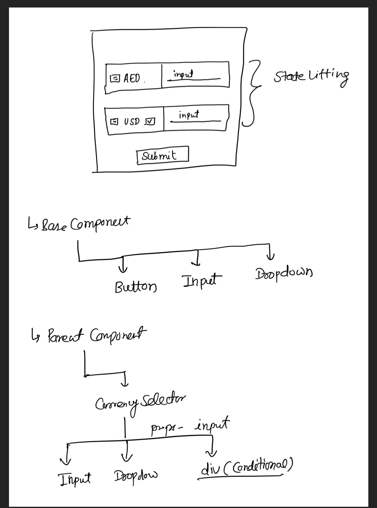

# Transfer-Cal

## Paper Work - Component Structure



## Introduction

Welcome to Transfer-Cal, a React Native project designed for currency exchange converter. This project is built using Expo and a range of dependencies to ensure a seamless user experience.

## Version

1.0.0

## Installation

First, make sure you have Expo CLI installed:

```bash
npm install -g expo-cli
```

To run this project, clone the repository and install the dependencies:

#### Clone the repository

```bash
git clone https://github.com/saif-bsf/transfer-cal.git
```

#### Go into the project directory

```bash
cd transfer-cal
```

#### Install dependencies

```bash
npm install
```

## Usage

You can start the project using one of the following commands:

- `npm start` - Starts the project using Expo.
- `npm run android` - Opens your app in an Android emulator if you're on macOS or Linux and have it configured, or a connected Android device.
- `npm run ios` - Opens your app in the iOS Simulator if you're on a Mac and have it installed.
- `npm run web` - Starts the project in a web browser.

## Testing

To run tests, use the following command:

```bash
npm test
```

## Dependencies

This project uses several key dependencies:

- **React Native With Expo:** For the app framework.
- **Jest:** For testing.
- **TypeScript:** For static type-checking.

Refer to the `package.json` file for a complete list of dependencies and their versions.

## Development Dependencies

This project includes several tools for development purposes:

- **Babel:** For JavaScript transpiling.
- **TypeScript:** For type checking.
- **Jest:** For testing.

Refer to the `package.json` file for the complete list of development dependencies and their versions.
